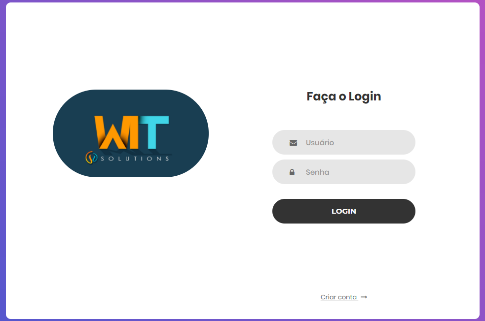
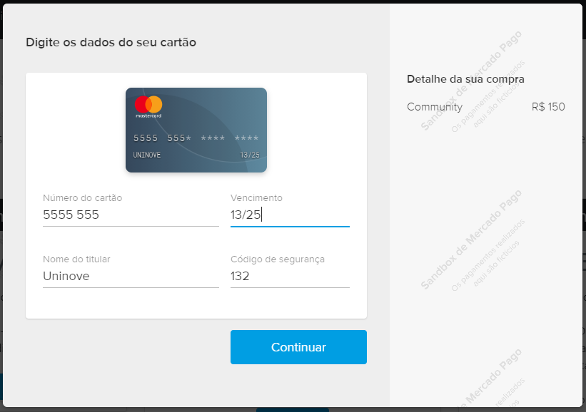
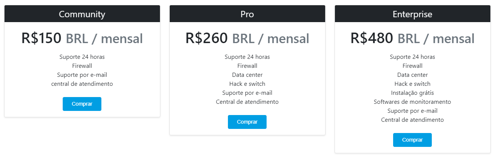
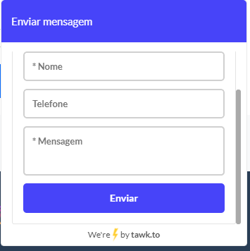

# **Wit Solutions**

## Dados da Turma
* Dia da semana: **Terça-Feira.**
* Período: **Tarde.**

## Integrantes
| RA   | NOME COMPLETO | CURSO | TURMA |
|------|---------------|-------|-------|
| 920102019 | JOÃO VINICIUS DA COSTA  | TADS | 3    |
| 920123532 | GABRIEL BARBOSA TEXEIRA | TADS | 3    |
| 920110693 | LEONARDO AUGUSTO COELHO FERREIRA  | TADS | 3    |

## Descrição do Projeto
Projeto WEB feito em **HTML, CSS, Bootstrap, JS e PHP**, banco de dados usamos o **mySQL** para guardar os dados do usuário e suas sessões. O site também terá um recurso com uma API de pagamentos [mercado pago payments](https://www.mercadopago.com.br/developers/pt/guides) via cartão de crédito e chat online usamos o [tawk.to](http://tawk.to/) para assim os clientes conseguirem comprar os planos de segurança que a **Wit Solutions** e ter o suporte necessário que a nossa empresa proporciona.

## Endereço da Aplicação
A aplicação será feita na Cloud do Heroku [Wit Solutions](https://wit-solutions.herokuapp.com/)

## Imagens
| Site | APi´s |
|------|-------|
|||
|||

